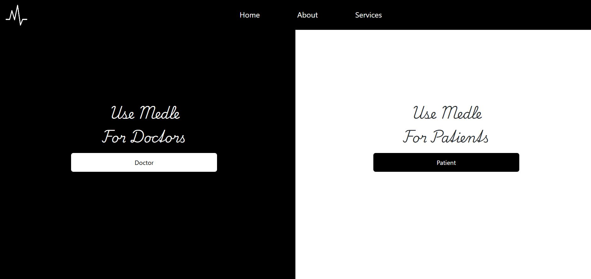

<h1>Medle - Secure Medical Records Management</h1>

Application is built on the principles of Confidentiality, Integrity, and Availability (CIA), and incorporates robust access control mechanisms to safeguard patient data.

Highlight: QR code method to initiate sessions between doctors and patients is employed. When a doctor logs in, a QR code with the hashed doctor ID is created. Patients can initiate a session by scanning this QR code, and the doctor must accept the request before proceeding. This mutual consent system ensures that access to patient medical records is only allowed if both the doctor and the patient agree. 

